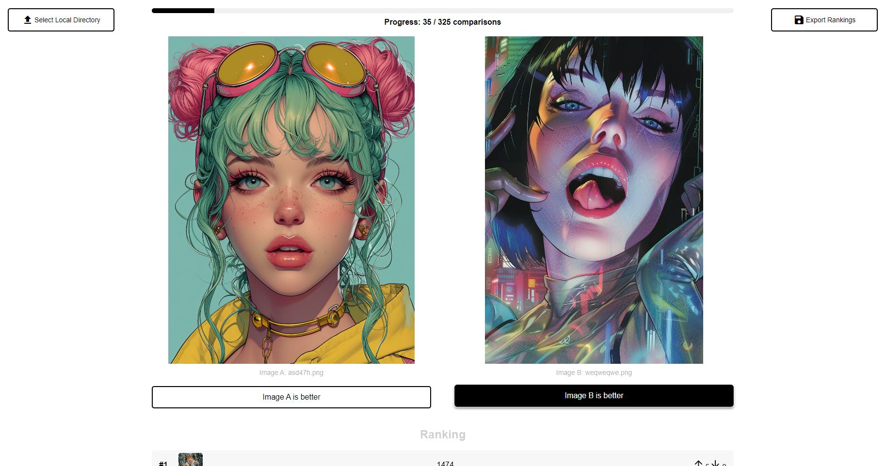

<div align="center">
  <h1>Image Ranker</h1>
  <p>
    <a href="https://opensource.org/licenses/MIT">
      
    </a>
    <a href="https://github.com/QuentinWach/1v1-image-ranker/stargazers">
      
    </a>
    <a href="https://github.com/QuentinWach/1v1-image-ranker/commits/main">
      
    </a>
  </p>
</div>



## Basic Features
- **ELO Algorithm**: Used to rank images based on pairwise comparisons.
- **Beautiful Web GUI**: Used to make it easy to use.
- **Import Images from Local Folder**: Used to easily import images from your computer.
- **Export Ranking Data as .CSV**: Used to export the ranking data so you can use it in other tools.

## Installation & Usage
1. Clone the repository:
   ```
   git clone https://github.com/QuentinWach/image-ranker.git
   cd image-ranker
   ```
2. Create a virtual environment (optional but recommended):
   ```
   python -m venv venv
   source venv/bin/activate  # On Windows, use `venv\Scripts\activate`
   ```
3. Install the required dependencies:
   ```
   pip install flask
   ```
4. Set up the project structure:
   ```
   mkdir -p static/images
   mkdir templates
   ```
5. Place your images in subdirectories within the `static/images/` folder.
6. Run the Flask app: `python app.py`.
7. Open a web browser and navigate to `http://localhost:5000`.

---
## ELO: How Does It Work?
The ELO algorithm, implemented in `elo.py`, is used to rank images based on pairwise comparisons. Here's how it works:

1. **Initialization**: 
   - Each image starts with an initial rating (default: 1400).
   - A K-factor (default: 32) determines the maximum change in rating after each comparison.

2. **Rating Calculation**:
   - When two images are compared, their current ratings are used to calculate the expected outcome.
   - The formula for expected score is: 1 / (1 + 10^((opponent_rating - player_rating) / 400))

3. **Rating Update**:
   - After each comparison, the ratings of both images are updated.
   - The winner's rating increases, and the loser's rating decreases.
   - The amount of change depends on the expected outcome and the actual outcome.
   - New Rating = Old Rating + K * (Actual Outcome - Expected Outcome)
     - Actual Outcome is 1 for the winner and 0 for the loser.

4. **Tracking Statistics**:
   - The system keeps track of the number of comparisons for each image.
   - It also counts upvotes (wins) and downvotes (losses) for each image.
   - Ensures that each image is compared against every other image exactly once which is necessary for the algorithm to converge. (Shown as a progress bar in the web app.)

5. **Ranking**:
   - Images are ranked based on their current ELO rating.
   - The `get_rankings()` method returns a sorted list of images by their ratings.

This implementation ensures that images consistently chosen as better will rise in the rankings, while those consistently chosen as worse will fall. The system is self-correcting and allows for dynamic changes in rankings as more comparisons are made.

