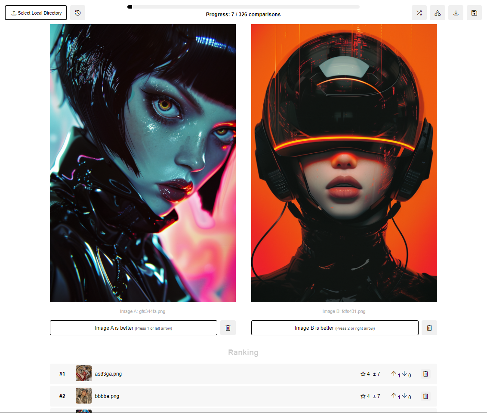

<div align="center">
  <h1>Image Ranker</h1>
  <p>
    <a href="https://opensource.org/licenses/MIT">
      
    </a>
    <a href="https://github.com/QuentinWach/1v1-image-ranker/stargazers">
      
    </a>
    <a href="https://github.com/QuentinWach/1v1-image-ranker/commits/main">
      
    </a>
  </p>
</div>



## ✨ Core Features
- **TrueSkill ELO algorithm.** An advanced algorithm that takes into account the uncertainty in the ratings and updates the ranks **globally** after each comparison since if $A > B$ and $B > C$ then we can infer that $A > C$. This achieves accurate results much faster than a typical ELO algorithm.
- **Various advanced ranking speedups.** 
  - **Sequential elimination.** Option to rank $N$ images in $\mathcal{O}(N)$-time rather than $\mathcal{O}(N \times (N-1)/2)$ by eliminating images from the ranking that have been down voted.
  - **Smart shuffle.** Shuffles all the images in such a way as to minimize the uncertainty of the ranking as fast as possible.
  - **Auto-shuffle.** Applies a smart shuffle every three comparisons automatically.
- **Web GUI for easy use.**
- **Select images from a local directory without needing to upload or move them.**
- **Export and save ranking data as CSV. Resume at any time.**

## 🚀 Installation & Usage
1. Clone the repository:
   ```
   git clone https://github.com/QuentinWach/image-ranker.git
   cd image-ranker
   ```
2. Create a virtual environment (optional but recommended):
   ```
   python -m venv venv
   source venv/bin/activate  # On Windows, use `venv\Scripts\activate`
   ```
3. Install the required dependencies:
   ```
   pip install flask trueskill
   ```
4. Run the Flask app: `python app.py`.
5. Open a web browser and navigate to `http://localhost:5000`.

---
## ❓ How It Works
### TrueSkill ELO
Each image is represented by two values:
- μ (mu): The estimated "skill" level.
- σ (sigma): The uncertainty in that estimate.

New items start with a default μ (often 25 but 0 here) and high σ (often 8.33). When two items are compared, their μ and σ values are used to calculate the expected outcome. The actual outcome is compared to this expectation. The winner's μ increases, the loser's decreases.Both items' σ typically decreases (representing increased certainty). The magnitude of changes depends on:
- How surprising the outcome was (based on current ratings).
- The current uncertainty (σ) of each item.

It uses Gaussian distributions to model skill levels and employs factor graphs and message passing for efficient updates. Items are typically ranked by their μ - 3σ (a conservative estimate).

Importantly, the algorithm updates all previously ranked items simultaneously with every comparison, rather than updating only the new images. This means that the algorithm can take into account all of the information available from the comparisons, rather than just the pairwise comparisons.

Thus, overall, this system allows for efficient ranking with incomplete comparison data, making it well-suited for large sets of items where exhaustive pairwise comparisons are impractical!

### Sequential Elimination
You have the option to enable _sequential elimination_ to rank $N$ images in $\mathcal{O}(N)$-time rather than $\mathcal{O}(N \times (N-1)/2)$ by eliminating images from the ranking that have been down voted. This is a great option when you have a large number of images and need to rank them quickly. It's also a good first step to take to get a rough overview of the ranking of the images and then disable this feature to get a more precise ranking as you continue.

### Smart & Auto-Shuffle
You can manually shuffle image pairs at any time by clicking the shuffle button or automatically shuffle every three comparisons. This is useful if you want to minimize the uncertainty of the ranking as fast as possible. Images that have only been ranked a few times and have a high uncertainty σ will be prioritized. This way, you don't spend more time ranking images that you are already certain about but can get a more accurate ranking of images with very similar scores faster.

---
## About
**Image Ranker** is part of a part of project to enable anyone to create their own _foundation_ models custom tailored to their specific needs.

Post-training foundation models is what makes them actually useful. For example, large language models may not even chat with you without post-training. The same is true for images. In order to do so, a common technique is [RLHF](https://huggingface.co/docs/trl/main/en/index), which uses a reward model to reward or punish the output of the generative foundation model based on user preferences. In order to create this reward model, we need to know the user preferences which requires a dataset, here images. So whether it is to make some radical changes to an already existing model like Stable Diffusion or Flux, or to train your own model, it is important to be able to rank the images somehow to know which images are better. This is where this app comes in.

## Contributing
If you have any questions, please open an issue on GitHub! And feel free to fork this project, to suggest or contribute new features. The `OPEN_TODO.md` file contains a list of features that are planned to be implemented. Help is very much appreciated! That said, the easiest way to support the project is to **give this repo a ⭐!**

Thank you!
