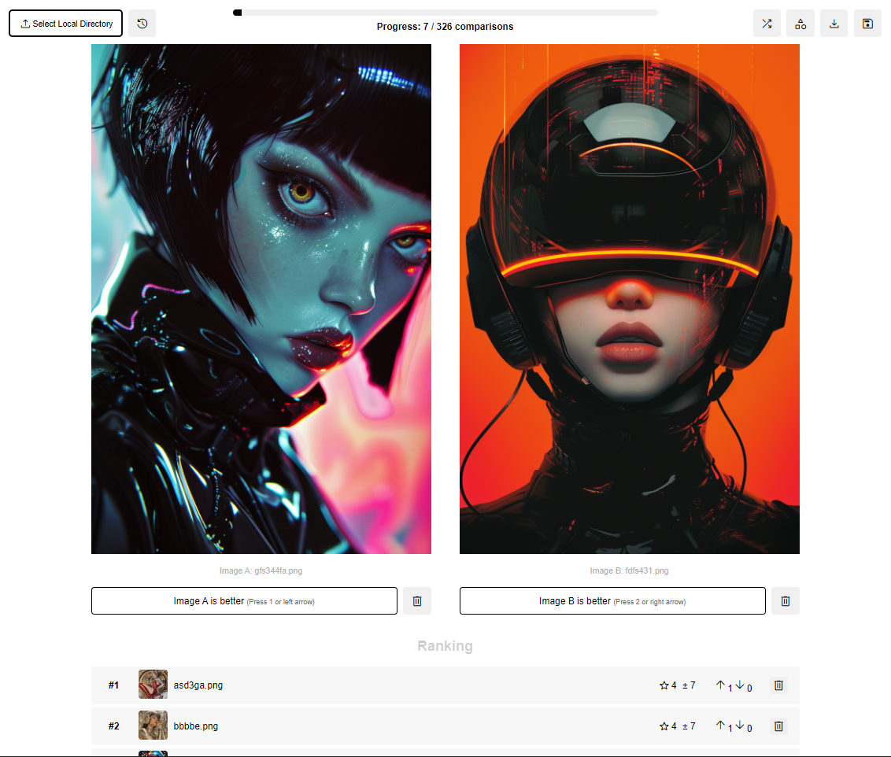

<div align="center">
  <h1>Image Ranker</h1>

  Maintained by [Quentin Wach](https://www.x.com/QuentinWach).

  <p>
    <a href="https://github.com/QuentinWach/image-ranker/actions/workflows/test.yml">
      
    </a>
    <a href="https://opensource.org/licenses/MIT">
      
    </a>
    <a href="https://github.com/QuentinWach/image-ranker/stargazers">
      
    </a>
    <a href="https://github.com/QuentinWach/image-ranker/commits/main">
      
    </a>
    <a href="https://doi.org/10.5281/zenodo.19264460">
      
    </a>
  </p>
</div>



## ✨ Core Features
- **[TrueSkill ELO algorithm](https://www.microsoft.com/en-us/research/wp-content/uploads/2007/01/NIPS2006_0688.pdf).** An advanced algorithm that takes into account the uncertainty in the ratings and updates the ranks **globally** after each comparison since if $A > B$ and $B > C$ then we can infer that $A > C$. This achieves accurate results much faster than a typical ELO algorithm.
- **Various advanced ranking speedups.** 
  - **Sequential elimination.** Option to rank $N$ images in $\mathcal{O}(N)$-time rather than $\mathcal{O}(N \times (N-1)/2)$ by eliminating images from the ranking that have been down voted.
  - **Smart shuffle.** Shuffles all the images in such a way as to minimize the uncertainty of the ranking as fast as possible.
  - **Auto-shuffle.** Applies a smart shuffle every three comparisons automatically.
- **Web GUI for easy use.**
- **Select images from a local directory without needing to upload or move them.**
- **Export and save ranking data as CSV. Resume at any time.**

## 🚀 Installation & Usage
1. Clone the repository:
   ```
   git clone https://github.com/QuentinWach/image-ranker.git
   cd image-ranker
   ```
2. Create and activate a virtual environment:
   ```
   python -m venv venv
   source venv/bin/activate  # On Windows, use `venv\Scripts\activate`
   ```
3. Install the project:
   ```
   pip install -e .
   ```
4. Run the Flask app:
   ```
   image-ranker
   ```
   You can also use `python app.py` if you prefer.
    - On startup, the app loads the bundled demo images from `static/images` so you can try it immediately.
    - When you open the directory picker, browsing starts in your home folder and you can also paste any absolute path directly in the UI.
    - If you want to intentionally restrict browsing to a specific subtree, set `BASE_DIR` (for example `BASE_DIR=/your/path image-ranker`).
5. Open a web browser and navigate to `http://localhost:5000`.


### Configuration

You can configure the application using the following environment variables:

- `AUTOSAVE_FREQUENCY`: The number of comparisons to make before automatically saving the rankings. The default is `10`.
- `SOUND_ENABLED`: Set to `false` to disable the click sound when comparing images. The default is `true`.
- `EXCLUSION_REASONS_FILE`: The path to a JSON file containing reasons for excluding an image. See the "Exclusion Reasons" section for more details.

Example:

```
AUTOSAVE_FREQUENCY=20 SOUND_ENABLED=false image-ranker
```

### Exclusion Reasons

You can provide a JSON file with reasons for excluding an image. This allows you to categorize your excluded images. If a valid exclusion reason file is provided, a modal will appear when you try to exclude an image, allowing you to select a reason for the exclusion.

The JSON file should be a simple key-value pair object, where the keys are short identifiers for the exclusion reason and the values are the descriptions that will be displayed to the user.

**Example `exclusion_reasons.json`:**
```json
{
  "blurry": "Blurry image",
  "low_quality": "Low quality",
  "duplicate": "Duplicate image",
  "other": "Other"
}
```

To use this feature, set the `EXCLUSION_REASONS_FILE` environment variable to the path of your JSON file:

```
EXCLUSION_REASONS_FILE=/path/to/your/exclusion_reasons.json image-ranker
```

### Image Context

You can provide context for your images by creating a `context.txt` or `context.json` file in the same directory as your images. If either of these files is present, a context button will appear for each image, allowing you to view the context in a modal.

The content can be plain text or HTML, which will be rendered in the modal.

#### `context.txt`

If you use a `context.txt` file, its content will be displayed for all images in that folder.

**Example `context.txt`:**
```
This is a general context for all images in this folder.
It can even include <strong>HTML</strong> tags.
```

#### `context.json`

For more specific context, you can use a `context.json` file. This file should contain a JSON object where the keys are the filenames of the images and the values are the context to be displayed.

You can also provide a `default` key, which will be used as a fallback for any image that doesn't have its own specific context.

**Example `context.json`:**
```json
{
  "image1.jpg": "This is the context for image1.jpg.",
  "image2.png": "<h1>Context for Image 2</h1><p>This image has a special context with HTML.</p>",
  "default": "This is the default context for all other images."
}
```

---
## ❓ How It Works
### TrueSkill ELO
Each image is represented by two values:
- μ (mu): The estimated "skill" level.
- σ (sigma): The uncertainty in that estimate.

New items start with a default μ (often 25 but 0 here) and high σ (often 8.33). When two items are compared, their μ and σ values are used to calculate the expected outcome. The actual outcome is compared to this expectation. The winner's μ increases, the loser's decreases.Both items' σ typically decreases (representing increased certainty). The magnitude of changes depends on:
- How surprising the outcome was (based on current ratings).
- The current uncertainty (σ) of each item.

It uses Gaussian distributions to model skill levels and employs factor graphs and message passing for efficient updates. Items are typically ranked by their μ - 3σ (a conservative estimate).

Importantly, the algorithm updates all previously ranked items simultaneously with every comparison, rather than updating only the new images. This means that the algorithm can take into account all of the information available from the comparisons, rather than just the pairwise comparisons.

Thus, overall, this system allows for efficient ranking with incomplete comparison data, making it well-suited for large sets of items where exhaustive pairwise comparisons are impractical!

For reference, see [Herbrich et al., "TrueSkill: A Bayesian Skill Rating System", 2007](https://www.microsoft.com/en-us/research/wp-content/uploads/2007/01/NIPS2006_0688.pdf) and [TrueSkill.org](https://trueskill.org/).

### Sequential Elimination
You have the option to enable _sequential elimination_ to rank $N$ images in $\mathcal{O}(N)$-time rather than $\mathcal{O}(N \times (N-1)/2)$ by eliminating images from the ranking that have been down voted. This is a great option when you have a large number of images and need to rank them quickly. It's also a good first step to get a rough overview of the ranking of the images and then disable this feature to get a more precise ranking as you continue.

### Smart & Auto-Shuffle
You can manually shuffle image pairs at any time by clicking the shuffle button or automatically shuffle every three comparisons. This is useful if you want to minimize the uncertainty of the ranking as fast as possible. Images that have only been ranked a few times and have a high uncertainty σ will be prioritized. This way, you don't spend more time ranking images that you are already certain about but can get a more accurate ranking of images with very similar scores faster.

---
## About
**Image Ranker** is part of a part of the overall effort to enable anyone to create their own _foundation_ models custom tailored to their specific needs.

Post-training foundation models is what makes them actually useful. For example, large language models may not even chat with you without post-training. The same is true for images. In order to do so, a common technique is [RLHF](https://huggingface.co/docs/trl/main/en/index), which uses a reward model to reward or punish the output of the generative foundation model based on user preferences. In order to create this reward model, we need to know the user preferences which requires a dataset, here images. So whether it is to make some radical changes to an already existing model like Stable Diffusion or Flux, or to train your own model, it is important to be able to rank the images somehow to know which images are better. This is where this app comes in.

## Contributing
If you have any questions, please open an issue on GitHub! And feel free to fork this project, to suggest or contribute new features. The `OPEN_TODO.md` file contains a list of features that are planned to be implemented. Help is very much appreciated! That said, the easiest way to support the project is to **give this repo a star!** Thank you!

## Citation
If you use Image Ranker in your research or projects, please cite it as:

```bibtex
@software{wach_image_ranker_2026,
  author       = {Wach, Quentin},
  title        = {Image Ranker: Fast Open-Source Pairwise Ranking for Human Preference Learning using TrueSkill},
  year         = {2026},
  publisher    = {Zenodo},
  version      = {v1.0.1},
  doi          = {10.5281/zenodo.19264460},
  url          = {https://doi.org/10.5281/zenodo.19264460}
}
```

Alternatively, you can cite it in plain text:

Quentin Wach. (2026). Image Ranker: Fast Open-Source Pairwise Ranking for Human Preference Learning using TrueSkill (v1.0.1). Zenodo. https://doi.org/10.5281/zenodo.19264460
